# Course Feedback System - Complete Flowcharts

## ADMIN ROLE FLOWCHARTS

### Figure 1: Admin Dashboard Page Flow

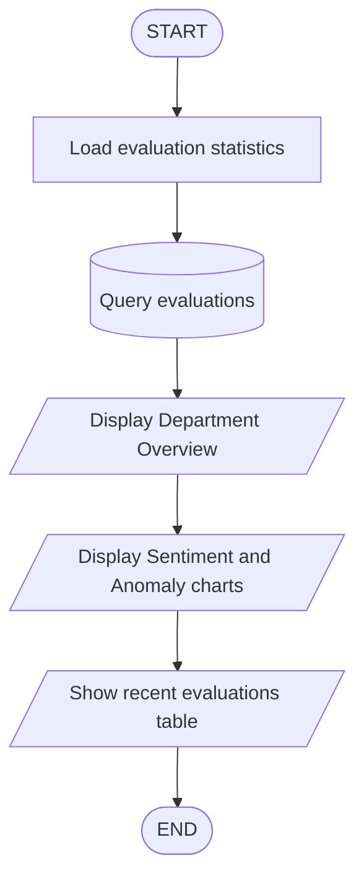
```mermaid
flowchart TD
    Start([START]) --> LoadStats[Load evaluation statistics]
    LoadStats --> QueryDB[(Query evaluations)]
    QueryDB --> DisplayOverview[/Display Department Overview/]
    DisplayOverview --> ShowCharts[/Display Sentiment and Anomaly charts/]
    ShowCharts --> ShowTable[/Show recent evaluations table/]
    ShowTable --> End([END])
```

### Figure 2: User Management Page Flow

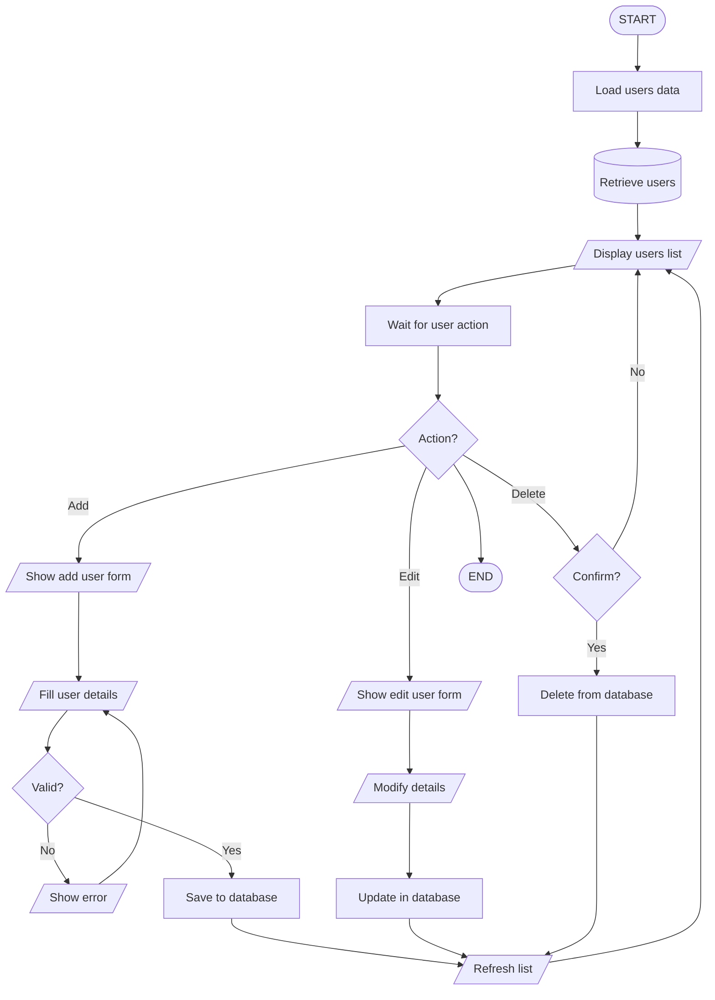
```mermaid
flowchart TD
    Start([START]) --> LoadUsers[Load users data]
    LoadUsers --> QueryDB[(Retrieve users)]
    QueryDB --> DisplayList[/Display users list/]
    DisplayList --> WaitAction[Wait for user action]
    WaitAction --> Action{Action?}
    
    Action -->|Add| ShowAddForm[/Show add user form/]
    Action -->|Edit| ShowEditForm[/Show edit user form/]
    Action -->|Delete| ConfirmDelete{Confirm?}
    Action --> End
    
    ShowAddForm --> FillDetails[/Fill user details/]
    FillDetails --> Valid{Valid?}
    Valid -->|No| ShowError[/Show error/]
    ShowError --> FillDetails
    Valid -->|Yes| SaveUser[Save to database]
    SaveUser --> Refresh[/Refresh list/]
    Refresh --> DisplayList
    
    ShowEditForm --> ModifyDetails[/Modify details/]
    ModifyDetails --> UpdateUser[Update in database]
    UpdateUser --> Refresh
    
    ConfirmDelete -->|No| DisplayList
    ConfirmDelete -->|Yes| DeleteUser[Delete from database]
    DeleteUser --> Refresh
    
    End([END])
```

### Figure 3: Course Management Page Flow

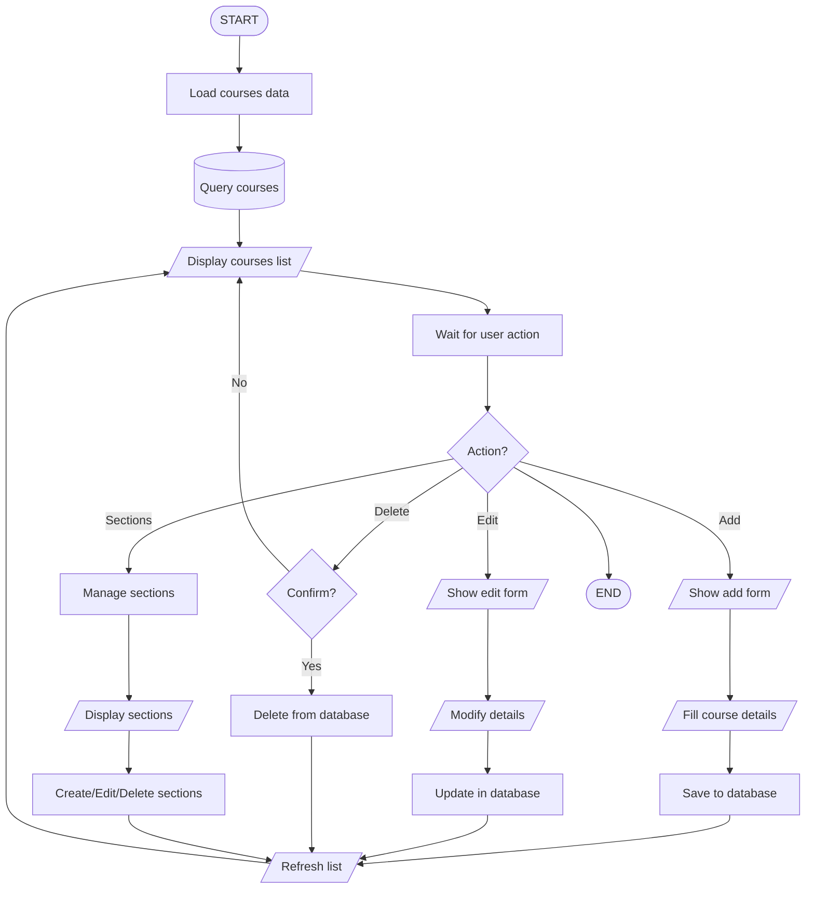
```mermaid
flowchart TD
    Start([START]) --> LoadCourses[Load courses data]
    LoadCourses --> QueryDB[(Query courses)]
    QueryDB --> DisplayList[/Display courses list/]
    DisplayList --> WaitAction[Wait for user action]
    WaitAction --> Action{Action?}
    
    Action -->|Add| ShowAddForm[/Show add form/]
    Action -->|Edit| ShowEditForm[/Show edit form/]
    Action -->|Delete| ConfirmDelete{Confirm?}
    Action -->|Sections| ManageSections[Manage sections]
    Action --> End
    
    ShowAddForm --> FillDetails[/Fill course details/]
    FillDetails --> SaveCourse[Save to database]
    SaveCourse --> Refresh[/Refresh list/]
    Refresh --> DisplayList
    
    ShowEditForm --> ModifyDetails[/Modify details/]
    ModifyDetails --> UpdateCourse[Update in database]
    UpdateCourse --> Refresh
    
    ConfirmDelete -->|No| DisplayList
    ConfirmDelete -->|Yes| DeleteCourse[Delete from database]
    DeleteCourse --> Refresh
    
    ManageSections --> ShowSections[/Display sections/]
    ShowSections --> SectionAction[Create/Edit/Delete sections]
    SectionAction --> Refresh
    
    End([END])
```

### Figure 4: Evaluation Period Management Page Flow

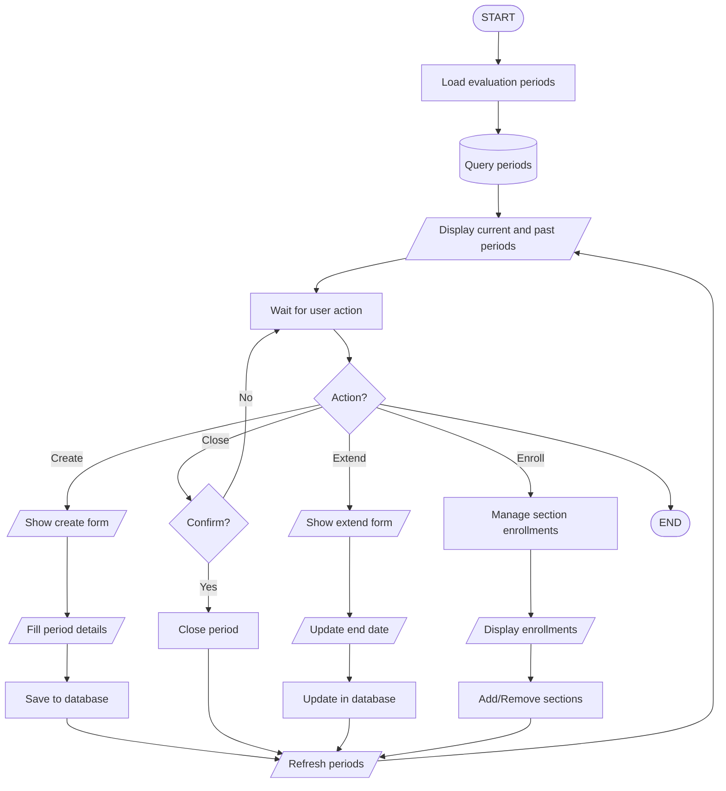
```mermaid
flowchart TD
    Start([START]) --> LoadPeriods[Load evaluation periods]
    LoadPeriods --> QueryDB[(Query periods)]
    QueryDB --> DisplayPeriods[/Display current and past periods/]
    DisplayPeriods --> WaitAction[Wait for user action]
    WaitAction --> Action{Action?}
    
    Action -->|Create| ShowCreateForm[/Show create form/]
    Action -->|Close| ConfirmClose{Confirm?}
    Action -->|Extend| ShowExtendForm[/Show extend form/]
    Action -->|Enroll| ManageEnroll[Manage section enrollments]
    Action --> End
    
    ShowCreateForm --> FillPeriod[/Fill period details/]
    FillPeriod --> SavePeriod[Save to database]
    SavePeriod --> Refresh[/Refresh periods/]
    Refresh --> DisplayPeriods
    
    ConfirmClose -->|No| WaitAction
    ConfirmClose -->|Yes| ClosePeriod[Close period]
    ClosePeriod --> Refresh
    
    ShowExtendForm --> ExtendDate[/Update end date/]
    ExtendDate --> UpdatePeriod[Update in database]
    UpdatePeriod --> Refresh
    
    ManageEnroll --> ShowEnrollments[/Display enrollments/]
    ShowEnrollments --> EnrollAction[Add/Remove sections]
    EnrollAction --> Refresh
    
    End([END])
```

### Figure 5: System Settings Page Flow

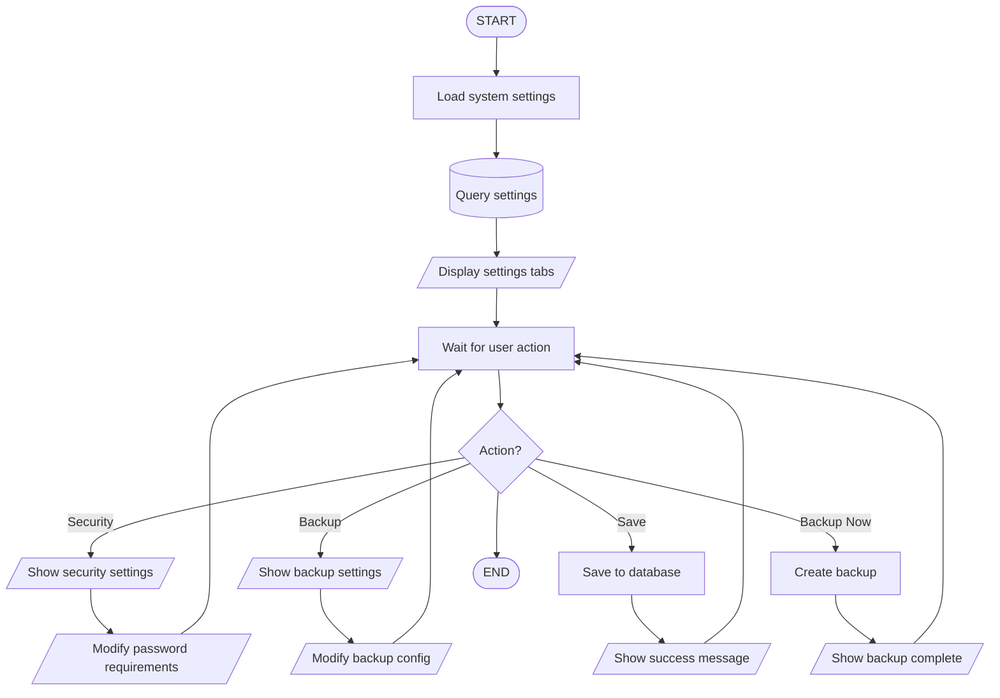
```mermaid
flowchart TD
    Start([START]) --> LoadSettings[Load system settings]
    LoadSettings --> QueryDB[(Query settings)]
    QueryDB --> DisplaySettings[/Display settings tabs/]
    DisplaySettings --> WaitAction[Wait for user action]
    WaitAction --> Action{Action?}
    
    Action -->|Security| ShowSecurity[/Show security settings/]
    Action -->|Backup| ShowBackup[/Show backup settings/]
    Action -->|Save| SaveSettings[Save to database]
    Action -->|Backup Now| CreateBackup[Create backup]
    Action --> End
    
    ShowSecurity --> ModifySecurity[/Modify password requirements/]
    ModifySecurity --> WaitAction
    
    ShowBackup --> ModifyBackup[/Modify backup config/]
    ModifyBackup --> WaitAction
    
    SaveSettings --> ShowSuccess[/Show success message/]
    ShowSuccess --> WaitAction
    
    CreateBackup --> ShowComplete[/Show backup complete/]
    ShowComplete --> WaitAction
    
    End([END])
```

### Figure 6: Data Export Center Page Flow

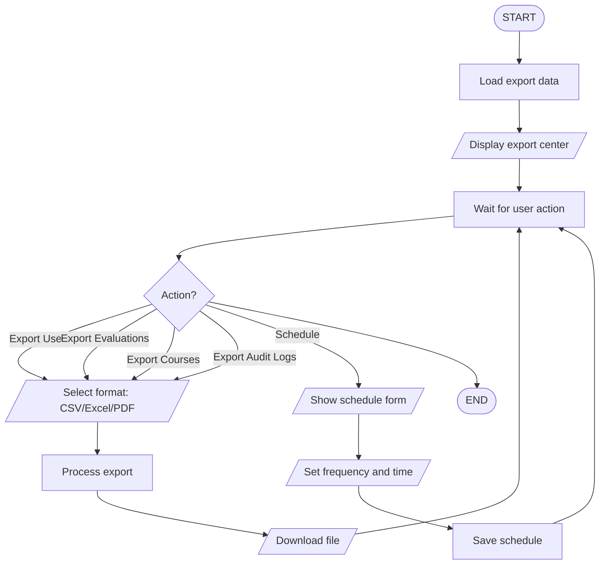
```mermaid
flowchart TD
    Start([START]) --> LoadExports[Load export data]
    LoadExports --> DisplayCenter[/Display export center/]
    DisplayCenter --> WaitAction[Wait for user action]
    WaitAction --> Action{Action?}
    
    Action -->|Export Users| SelectFormat[/Select format: CSV/Excel/PDF/]
    Action -->|Export Evaluations| SelectFormat
    Action -->|Export Courses| SelectFormat
    Action -->|Export Audit Logs| SelectFormat
    Action -->|Schedule| ShowScheduleForm[/Show schedule form/]
    Action --> End
    
    SelectFormat --> ProcessExport[Process export]
    ProcessExport --> DownloadFile[/Download file/]
    DownloadFile --> WaitAction
    
    ShowScheduleForm --> SetSchedule[/Set frequency and time/]
    SetSchedule --> SaveSchedule[Save schedule]
    SaveSchedule --> WaitAction
    
    End([END])
```

### Figure 7: Audit Log Viewer Page Flow

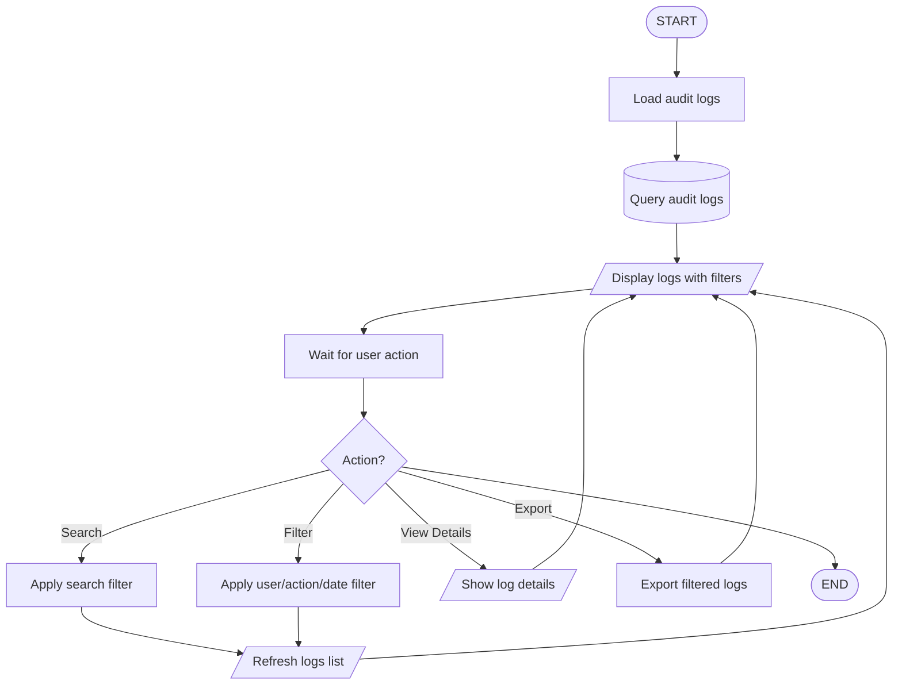
```mermaid
flowchart TD
    Start([START]) --> LoadLogs[Load audit logs]
    LoadLogs --> QueryDB[(Query audit logs)]
    QueryDB --> DisplayLogs[/Display logs with filters/]
    DisplayLogs --> WaitAction[Wait for user action]
    WaitAction --> Action{Action?}
    
    Action -->|Search| ApplySearch[Apply search filter]
    Action -->|Filter| ApplyFilter[Apply user/action/date filter]
    Action -->|View Details| ShowDetails[/Show log details/]
    Action -->|Export| ExportLogs[Export filtered logs]
    Action --> End
    
    ApplySearch --> Refresh[/Refresh logs list/]
    ApplyFilter --> Refresh
    Refresh --> DisplayLogs
    
    ShowDetails --> DisplayLogs
    ExportLogs --> DisplayLogs
    
    End([END])
```

### Figure 8: Email Notifications Page Flow

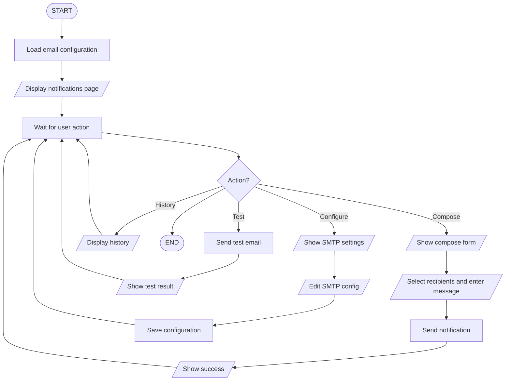
```mermaid
flowchart TD
    Start([START]) --> LoadConfig[Load email configuration]
    LoadConfig --> DisplayPage[/Display notifications page/]
    DisplayPage --> WaitAction[Wait for user action]
    WaitAction --> Action{Action?}
    
    Action -->|Compose| ShowForm[/Show compose form/]
    Action -->|Configure| ShowSettings[/Show SMTP settings/]
    Action -->|Test| SendTest[Send test email]
    Action -->|History| ShowHistory[/Display history/]
    Action --> End
    
    ShowForm --> FillForm[/Select recipients and enter message/]
    FillForm --> SendEmail[Send notification]
    SendEmail --> ShowSuccess[/Show success/]
    ShowSuccess --> WaitAction
    
    ShowSettings --> EditSettings[/Edit SMTP config/]
    EditSettings --> SaveSettings[Save configuration]
    SaveSettings --> WaitAction
    
    SendTest --> ShowTestResult[/Show test result/]
    ShowTestResult --> WaitAction
    
    ShowHistory --> WaitAction
    
    End([END])
```

### Figure 9: Program Sections Management Page Flow

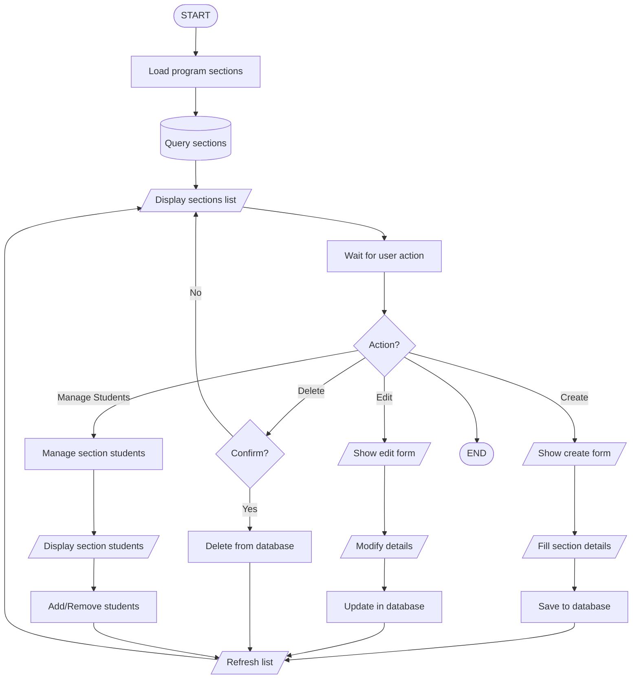
```mermaid
flowchart TD
    Start([START]) --> LoadSections[Load program sections]
    LoadSections --> QueryDB[(Query sections)]
    QueryDB --> DisplayList[/Display sections list/]
    DisplayList --> WaitAction[Wait for user action]
    WaitAction --> Action{Action?}
    
    Action -->|Create| ShowCreateForm[/Show create form/]
    Action -->|Edit| ShowEditForm[/Show edit form/]
    Action -->|Delete| ConfirmDelete{Confirm?}
    Action -->|Manage Students| ManageStudents[Manage section students]
    Action --> End
    
    ShowCreateForm --> FillDetails[/Fill section details/]
    FillDetails --> SaveSection[Save to database]
    SaveSection --> Refresh[/Refresh list/]
    Refresh --> DisplayList
    
    ShowEditForm --> ModifyDetails[/Modify details/]
    ModifyDetails --> UpdateSection[Update in database]
    UpdateSection --> Refresh
    
    ConfirmDelete -->|No| DisplayList
    ConfirmDelete -->|Yes| DeleteSection[Delete from database]
    DeleteSection --> Refresh
    
    ManageStudents --> ShowStudents[/Display section students/]
    ShowStudents --> StudentAction[Add/Remove students]
    StudentAction --> Refresh
    
    End([END])
```

---

## SECRETARY/DEPARTMENT HEAD ROLE FLOWCHARTS

### Figure 10: Staff Dashboard Page Flow

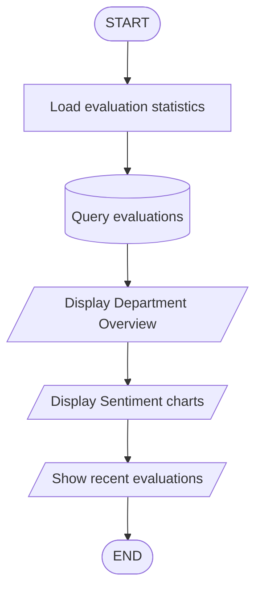
```mermaid
flowchart TD
    Start([START]) --> LoadStats[Load evaluation statistics]
    LoadStats --> QueryDB[(Query evaluations)]
    QueryDB --> DisplayOverview[/Display Department Overview/]
    DisplayOverview --> ShowCharts[/Display Sentiment charts/]
    ShowCharts --> ShowTable[/Show recent evaluations/]
    ShowTable --> End([END])
```

### Figure 11: Staff Courses Page Flow

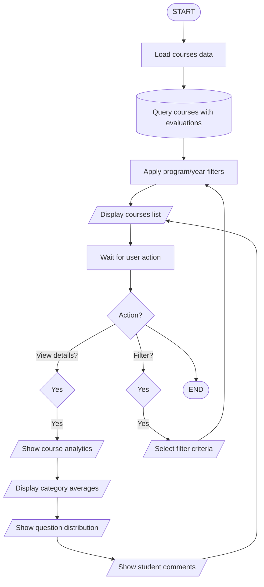
```mermaid
flowchart TD
    Start([START]) --> LoadCourses[Load courses data]
    LoadCourses --> QueryDB[(Query courses with evaluations)]
    QueryDB --> ApplyFilters[Apply program/year filters]
    ApplyFilters --> DisplayList[/Display courses list/]
    DisplayList --> WaitAction[Wait for user action]
    WaitAction --> ActionChoice{Action?}
    
    ActionChoice -->|View details?| ViewDetails{Yes}
    ActionChoice -->|Filter?| ApplyNewFilter{Yes}
    ActionChoice --> End
    
    ViewDetails -->|Yes| ShowCourseDetails[/Show course analytics/]
    ShowCourseDetails --> DisplayCharts[/Display category averages/]
    DisplayCharts --> ShowDistribution[/Show question distribution/]
    ShowDistribution --> ShowComments[/Show student comments/]
    ShowComments --> DisplayList
    
    ApplyNewFilter -->|Yes| SelectFilter[/Select filter criteria/]
    SelectFilter --> ApplyFilters
    
    End([END])
```

### Figure 12: Staff Evaluations Page Flow

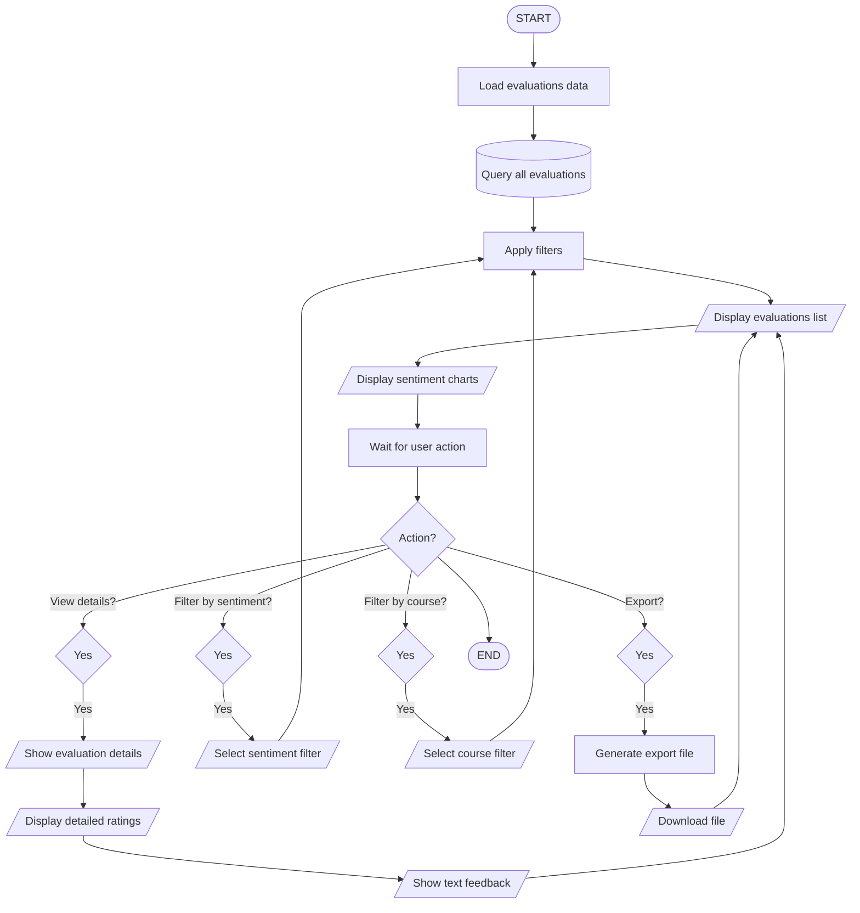
```mermaid
flowchart TD
    Start([START]) --> LoadEvals[Load evaluations data]
    LoadEvals --> QueryDB[(Query all evaluations)]
    QueryDB --> ApplyFilters[Apply filters]
    ApplyFilters --> DisplayList[/Display evaluations list/]
    DisplayList --> ShowCharts[/Display sentiment charts/]
    ShowCharts --> WaitAction[Wait for user action]
    WaitAction --> ActionChoice{Action?}
    
    ActionChoice -->|View details?| ViewDetails{Yes}
    ActionChoice -->|Filter by sentiment?| FilterSentiment{Yes}
    ActionChoice -->|Filter by course?| FilterCourse{Yes}
    ActionChoice -->|Export?| ExportData{Yes}
    ActionChoice --> End
    
    ViewDetails -->|Yes| ShowDetails[/Show evaluation details/]
    ShowDetails --> DisplayRatings[/Display detailed ratings/]
    DisplayRatings --> ShowFeedback[/Show text feedback/]
    ShowFeedback --> DisplayList
    
    FilterSentiment -->|Yes| SelectSentiment[/Select sentiment filter/]
    SelectSentiment --> ApplyFilters
    
    FilterCourse -->|Yes| SelectCourse[/Select course filter/]
    SelectCourse --> ApplyFilters
    
    ExportData -->|Yes| GenerateExport[Generate export file]
    GenerateExport --> DownloadFile[/Download file/]
    DownloadFile --> DisplayList
    
    End([END])
```

### Figure 13: Sentiment Analysis Page Flow

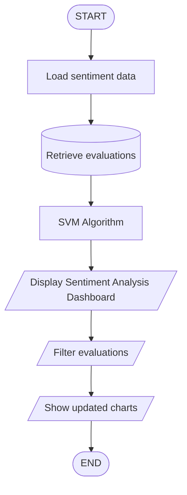
```mermaid
flowchart TD
    Start([START]) --> LoadSentiment[Load sentiment data]
    LoadSentiment --> QueryDB[(Retrieve evaluations)]
    QueryDB --> RunAlgorithm[SVM Algorithm]
    RunAlgorithm --> DisplayDashboard[/Display Sentiment Analysis Dashboard/]
    DisplayDashboard --> FilterEvals[/Filter evaluations/]
    FilterEvals --> ShowCharts[/Show updated charts/]
    ShowCharts --> End([END])
```

### Figure 14: Anomaly Detection Page Flow

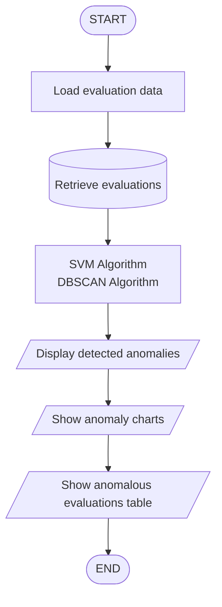
```mermaid
flowchart TD
    Start([START]) --> LoadAnomalies[Load evaluation data]
    LoadAnomalies --> QueryDB[(Retrieve evaluations)]
    QueryDB --> RunAlgorithms[SVM Algorithm<br/>DBSCAN Algorithm]
    RunAlgorithms --> DisplayAnomalies[/Display detected anomalies/]
    DisplayAnomalies --> ShowCharts[/Show anomaly charts/]
    ShowCharts --> ShowTable[/Show anomalous evaluations table/]
    ShowTable --> End([END])
```

---

## STUDENT ROLE FLOWCHARTS

### Figure 15: Student Evaluation Page Flow

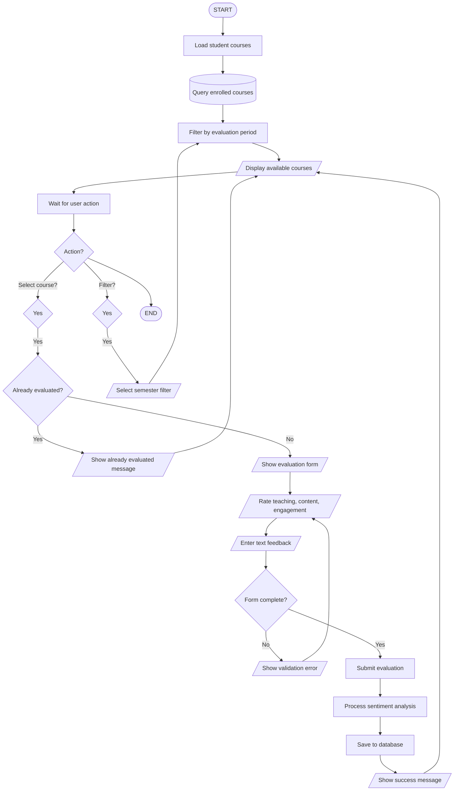
```mermaid
flowchart TD
    Start([START]) --> LoadCourses[Load student courses]
    LoadCourses --> QueryDB[(Query enrolled courses)]
    QueryDB --> FilterCourses[Filter by evaluation period]
    FilterCourses --> DisplayList[/Display available courses/]
    DisplayList --> WaitAction[Wait for user action]
    WaitAction --> ActionChoice{Action?}
    
    ActionChoice -->|Select course?| SelectCourse{Yes}
    ActionChoice -->|Filter?| ApplyFilter{Yes}
    ActionChoice --> End
    
    SelectCourse -->|Yes| CheckStatus{Already evaluated?}
    CheckStatus -->|Yes| ShowMessage[/Show already evaluated message/]
    ShowMessage --> DisplayList
    CheckStatus -->|No| ShowEvalForm[/Show evaluation form/]
    ShowEvalForm --> RateCategories[/Rate teaching, content, engagement/]
    RateCategories --> EnterFeedback[/Enter text feedback/]
    EnterFeedback --> ValidateForm{Form complete?}
    ValidateForm -->|No| ShowError[/Show validation error/]
    ShowError --> RateCategories
    ValidateForm -->|Yes| SubmitEval[Submit evaluation]
    SubmitEval --> ProcessSentiment[Process sentiment analysis]
    ProcessSentiment --> SaveToDB[Save to database]
    SaveToDB --> ShowSuccess[/Show success message/]
    ShowSuccess --> DisplayList
    
    ApplyFilter -->|Yes| SelectSemester[/Select semester filter/]
    SelectSemester --> FilterCourses
    
    End([END])
```

### Figure 16: Student My Courses Page Flow

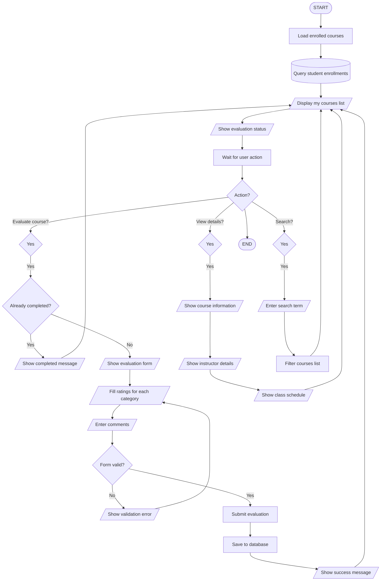
```mermaid
flowchart TD
    Start([START]) --> LoadCourses[Load enrolled courses]
    LoadCourses --> QueryDB[(Query student enrollments)]
    QueryDB --> DisplayList[/Display my courses list/]
    DisplayList --> ShowStatus[/Show evaluation status/]
    ShowStatus --> WaitAction[Wait for user action]
    WaitAction --> ActionChoice{Action?}
    
    ActionChoice -->|Evaluate course?| EvaluateCourse{Yes}
    ActionChoice -->|View details?| ViewDetails{Yes}
    ActionChoice -->|Search?| SearchCourse{Yes}
    ActionChoice --> End
    
    EvaluateCourse -->|Yes| CheckCompleted{Already completed?}
    CheckCompleted -->|Yes| ShowCompleted[/Show completed message/]
    ShowCompleted --> DisplayList
    CheckCompleted -->|No| ShowEvalForm[/Show evaluation form/]
    ShowEvalForm --> FillRatings[/Fill ratings for each category/]
    FillRatings --> EnterComments[/Enter comments/]
    EnterComments --> ValidateForm{Form valid?}
    ValidateForm -->|No| ShowError[/Show validation error/]
    ShowError --> FillRatings
    ValidateForm -->|Yes| SubmitEval[Submit evaluation]
    SubmitEval --> SaveToDB[Save to database]
    SaveToDB --> ShowSuccess[/Show success message/]
    ShowSuccess --> DisplayList
    
    ViewDetails -->|Yes| ShowCourseInfo[/Show course information/]
    ShowCourseInfo --> ShowInstructor[/Show instructor details/]
    ShowInstructor --> ShowSchedule[/Show class schedule/]
    ShowSchedule --> DisplayList
    
    SearchCourse -->|Yes| EnterSearch[/Enter search term/]
    EnterSearch --> FilterList[Filter courses list]
    FilterList --> DisplayList
    
    End([END])
```

### Figure 17: Student Evaluate Course Form Flow

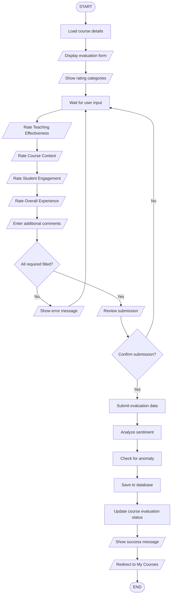
```mermaid
flowchart TD
    Start([START]) --> LoadCourse[Load course details]
    LoadCourse --> DisplayForm[/Display evaluation form/]
    DisplayForm --> ShowCategories[/Show rating categories/]
    ShowCategories --> WaitInput[Wait for user input]
    
    WaitInput --> RateTeaching[/Rate Teaching Effectiveness/]
    RateTeaching --> RateContent[/Rate Course Content/]
    RateContent --> RateEngagement[/Rate Student Engagement/]
    RateEngagement --> RateOverall[/Rate Overall Experience/]
    RateOverall --> EnterComments[/Enter additional comments/]
    EnterComments --> ValidateForm{All required filled?}
    
    ValidateForm -->|No| ShowError[/Show error message/]
    ShowError --> WaitInput
    
    ValidateForm -->|Yes| ReviewSubmission[/Review submission/]
    ReviewSubmission --> ConfirmSubmit{Confirm submission?}
    ConfirmSubmit -->|No| WaitInput
    ConfirmSubmit -->|Yes| SubmitData[Submit evaluation data]
    SubmitData --> AnalyzeSentiment[Analyze sentiment]
    AnalyzeSentiment --> CheckAnomaly[Check for anomaly]
    CheckAnomaly --> SaveToDB[Save to database]
    SaveToDB --> UpdateStatus[Update course evaluation status]
    UpdateStatus --> ShowSuccess[/Show success message/]
    ShowSuccess --> RedirectToCourses[/Redirect to My Courses/]
    RedirectToCourses --> End([END])
```

---

**Notes:**
- All flowcharts follow the style of your provided examples
- Decision shapes use only **Yes/No** as requested
- Process shapes use `/` for input/output operations
- Database operations use `[(cylindrical shape)]`
- Simplified flows focusing on main user actions
- Removed excessive error handling to match example style
- End nodes use proper parallelogram shape `([END])`
