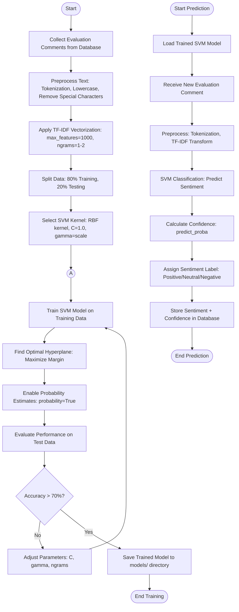
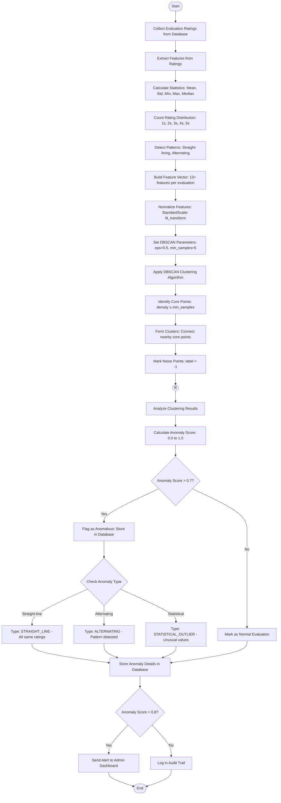

# ML Algorithm Flowcharts - Course Feedback System

## SVM Sentiment Analysis Flowchart

---

## DBSCAN Anomaly Detection Flowchart

---

## Feature Extraction for DBSCAN

**Features Extracted (13+ per evaluation):**
1. Mean rating (average of all ratings)
2. Standard deviation (spread of ratings)
3. Minimum rating
4. Maximum rating
5. Median rating
6. Count of rating value 1
7. Count of rating value 2
8. Count of rating value 3
9. Count of rating value 4
10. Count of rating value 5
11. Variance (rating spread)
12. Range (max - min)
13. Straight-lining indicator (1.0 if all same, 0.0 otherwise)
14. Alternating pattern score (0.0 to 1.0)
15+ Individual rating values for each question

---

## SVM Text Preprocessing Steps

**TF-IDF Vectorization:**
- Maximum features: 1000 most important terms
- N-grams: Unigrams (1-word) and Bigrams (2-word phrases)
- Min document frequency: 2 (term must appear in at least 2 documents)
- Max document frequency: 0.8 (ignore terms in >80% of documents)
- Stop words: Remove common English words (the, is, at, etc.)

**Example:**
- Input: "Prof. Garcia is excellent! Very engaging lectures."
- After preprocessing: "prof garcia excellent engaging lecture"
- TF-IDF vector: [0.45, 0.23, 0.67, 0.12, ...] (1000 dimensions)

---

## Key Differences from Reference Flowchart

**Our SVM Implementation:**
- Uses TF-IDF instead of generic preprocessing
- Includes probability estimation for confidence scores
- Auto-saves models for reuse
- 3-class classification (positive/neutral/negative) vs binary

**Our DBSCAN Implementation:**
- Extracts 13+ features (vs simpler approach)
- Includes pattern detection (straight-lining, alternating)
- Calculates continuous anomaly scores (0.0-1.0)
- Auto-categorizes anomaly types
- Integrates with admin alerting system

