# Course Feedback System - UI Flowcharts for Thesis

## Table of Contents
1. [System Overview](#system-overview)
2. [Admin Role Flowcharts](#admin-role-flowcharts)
3. [Staff Role Flowcharts](#staff-role-flowcharts)
4. [Student Role Flowcharts](#student-role-flowcharts)

---

## System Overview

### Figure 1: Login Page Flow


**Description:** The login page allows users to enter their email and password credentials. The system validates the credentials against the database. If invalid, an error message is displayed and the user can try again. If valid, user data is loaded, a success message is shown, and the user is redirected to their respective dashboard based on their role.

---

## Admin Role Flowcharts

### Figure 2: Admin Dashboard Page Flow


**Description:** The Admin Dashboard displays a comprehensive overview of the evaluation system. Upon loading, the sidebar is displayed followed by fetching evaluation statistics from the database. The dashboard shows key metrics and department overview. Advanced algorithms (SVM for sentiment analysis and DBSCAN for anomaly detection) process the evaluation data to generate insights. The results are displayed through various charts showing sentiment distribution and anomaly patterns. A table of recent evaluations is shown, and admins can manage evaluation questions from this interface.

---

### Figure 3: User Management Page Flow


**Description:** The User Management page allows administrators to manage all system users. The page loads and retrieves all users from the database, displaying them in a list. Administrators can add new users by filling out a form with validation checks. They can edit existing user information, which also includes validation. Users can be deleted after confirmation. All actions refresh the user list to show the updated data.

---

### Figure 4: Course Management Page Flow

```mermaid
flowchart TD
    Start([START]) --> LoadCourses[Load courses data]
    LoadCourses --> QueryDB[(Retrieve courses)]
    QueryDB --> DisplayCourses[Display courses list]
    DisplayCourses --> WaitAction[Wait for user action]
    WaitAction --> CheckAdd{Add course?}
    CheckAdd -->|Yes| ShowAddForm[Show add course form]
    CheckAdd -->|No| CheckEdit{Edit course?}
    ShowAddForm --> FillCourse[Fill course details]
    FillCourse --> ValidateCourse{Valid?}
    ValidateCourse -->|No| ShowError[Show validation error]
    ShowError --> FillCourse
    ValidateCourse -->|Yes| SaveCourse[Save course to database]
    SaveCourse --> RefreshList[Refresh courses list]
    RefreshList --> DisplayCourses
    CheckEdit -->|Yes| ShowEditForm[Show edit course form]
    CheckEdit -->|No| CheckDelete{Delete course?}
    ShowEditForm --> ModifyCourse[Modify course details]
    ModifyCourse --> ValidateEdit{Valid?}
    ValidateEdit -->|No| ShowEditError[Show validation error]
    ShowEditError --> ModifyCourse
    ValidateEdit -->|Yes| UpdateCourse[Update course in database]
    UpdateCourse --> RefreshList
    CheckDelete -->|Yes| ConfirmDelete{Confirm deletion?}
    CheckDelete -->|No| DisplayCourses
    ConfirmDelete -->|No| DisplayCourses
    ConfirmDelete -->|Yes| DeleteCourse[Delete course from database]
    DeleteCourse --> RefreshList

    style Start fill:#e1f5e1
    style QueryDB fill:#f0f0f0
```


**Description:** The Course Management page enables administrators to manage academic courses. Upon loading, all courses are retrieved from the database and displayed in a list. Administrators can add new courses by completing a form with validation. They can edit existing course information or delete courses after confirmation. Each action updates the course list to reflect changes.

---

### Figure 5: Evaluation Period Management Page Flow


**Description:** The Evaluation Period Management page controls the scheduling of evaluation periods. Administrators can create new periods with date validation to ensure end dates come after start dates. Only one period can be active at a time - activating a period automatically deactivates others and triggers student notifications. Periods can be edited or deleted, but deletion is prevented if evaluations have been submitted to preserve data integrity.

---

### Figure 6: System Settings Page Flow


**Description:** The System Settings page provides control over system configuration through tabbed categories: General (system name, institution details), Email (SMTP configuration), Security (password policies, session settings), and Evaluation (questionnaire settings). Administrators modify settings within each tab, validate changes, save to database, and log all modifications for audit purposes.

---

### Figure 7: Audit Log Viewer Page Flow


**Description:** The Audit Log Viewer displays all system activities for security monitoring. Logs are retrieved from the database and shown in a table with filtering options. Administrators can view detailed information for each log entry and export logs in multiple formats (CSV, Excel, PDF) for reporting and compliance purposes.

---

### Figure 8: Data Export Center Page Flow


**Description:** The Data Export Center provides flexible data export capabilities. Administrators select an export type (users, courses, evaluations, or reports), configure filters and parameters, choose an export format, and generate the file. All export activities are logged, and files are automatically downloaded upon generation.

---

## Staff Role Flowcharts (Department Head/Secretary/Instructor)

### Figure 9: Staff Dashboard Page Flow


**Description:** The Staff Dashboard provides department heads, secretaries, and instructors with an overview of evaluation data relevant to their access level. The sidebar navigation is displayed, followed by loading evaluation statistics from the database. The dashboard shows department overview with personalized information. Advanced algorithms (SVM and DBSCAN) analyze the data to generate sentiment and anomaly insights displayed through interactive charts. Recent evaluations are shown in a table, and staff can manage evaluation questions based on their permissions.

---

### Figure 10: Staff Courses Page Flow


**Description:** The Staff Courses page displays courses accessible to staff based on their role. Courses are retrieved from the database and displayed with filtering options. Staff can view detailed course information with performance charts, navigate to view course evaluations, or export course reports. The interface provides role-specific access to course data.

---

### Figure 11: Staff Evaluations Page Flow


**Description:** The Staff Evaluations page allows staff to view and analyze course evaluations. Evaluations are retrieved based on staff access permissions and displayed with filtering capabilities. Staff can view detailed evaluation information including category ratings and student comments (anonymized), compare multiple courses side-by-side, and export evaluation data for further analysis.

---

### Figure 12: Sentiment Analysis Page Flow


**Description:** The Sentiment Analysis page provides NLP-powered analysis of evaluation comments. Evaluations are retrieved and processed through the SVM algorithm to classify sentiment as positive, neutral, or negative. The dashboard displays sentiment distribution, trends, and insights through various visualizations. Staff can view word clouds showing frequently mentioned terms, explore extracted themes, analyze sentiment by course, and export comprehensive reports.

---

### Figure 13: Anomaly Detection Page Flow


**Description:** The Anomaly Detection page uses the DBSCAN algorithm to identify unusual patterns in evaluation data. Evaluations are fetched from the database and processed to detect anomalies such as suspicious rating patterns, outliers, or inconsistent responses. The system displays an anomaly preview followed by filtered charts showing detected anomalies. Staff can filter and review the anomaly list, with detailed information about each detected anomaly. If no anomalies are found, a message is displayed indicating the data is clean.

---

### Figure 14: Evaluation Questions Management Page Flow


**Description:** The Evaluation Questions Management page allows authorized staff to manage the questionnaire structure. Questions are loaded from the database and displayed by category. Staff can add new questions with validation, edit existing questions, delete or disable questions (questions used in evaluations are disabled rather than deleted), and reorder questions within categories using drag-and-drop. All changes are saved to the database and the question list is refreshed.

---

## Student Role Flowcharts

### Figure 15: Student Evaluation Page Flow


**Description:** Students access their evaluation dashboard to see pending course evaluations. When selecting a course, the questionnaire is loaded with questions organized by category. Students answer all questions (ratings and/or text responses), can add optional comments, and review their answers before submission. After submission, the evaluation is saved and the course status is updated. Students can then continue with other pending evaluations or review their completed evaluations.

---

### Figure 16: Student Evaluation Form Submission Flow


**Description:** The Evaluation Form guides students through submitting course feedback. The questionnaire is loaded from the database and displayed by categories. Students answer required questions on a rating scale and can enter optional comments. Responses are saved locally allowing draft saves for later completion. Upon submission, the system validates completeness, analyzes comment sentiment, calculates scores, saves to the database maintaining anonymity, clears the local draft, updates the course evaluation status, and displays a success confirmation.

---

### Figure 17: Student Courses View Page Flow


**Description:** The Student Courses View displays all courses a student is enrolled in with detailed information including course codes, names, instructors, schedules, and credits. Evaluation status badges indicate whether courses have been evaluated, are pending, or not yet available for evaluation. Students can search courses, filter by semester or evaluation status, view detailed course information, navigate to evaluation forms for available courses, and toggle between grid and list display views.

---

## Summary of Pages by Role

### Admin Pages (8 Pages)
1. **Admin Dashboard** - System overview with statistics and analytics
2. **User Management** - Manage all system users (CRUD operations)
3. **Course Management** - Manage courses and course sections
4. **Evaluation Period Management** - Configure and control evaluation periods
5. **System Settings** - Configure system-wide settings
6. **Audit Log Viewer** - View and export system activity logs
7. **Data Export Center** - Export data and generate reports

### Staff Pages (6 Pages) - Department Head/Secretary/Instructor
1. **Staff Dashboard** - Role-specific analytics and metrics with ML algorithms
2. **Courses** - View accessible courses and performance data
3. **Evaluations** - View and analyze student evaluations
4. **Sentiment Analysis** - NLP-powered sentiment analysis with SVM algorithm
5. **Anomaly Detection** - Detect suspicious patterns with DBSCAN algorithm
6. **Evaluation Questions** - View and manage (if authorized) questionnaire

### Student Pages (3 Pages)
1. **Student Evaluation** - View courses and their evaluation status
2. **Evaluation Form** - Submit course feedback with ratings and comments
3. **Student Courses** - View enrolled courses with detailed information

---

## Key Features by Flowchart

### Data Processing & Algorithms
- **SVM Algorithm**: Used in sentiment analysis to classify comments as positive, neutral, or negative
- **DBSCAN Algorithm**: Used in anomaly detection to identify unusual evaluation patterns
- **Database Queries**: Represented with cylinder shapes showing data retrieval operations

### User Interactions
- **CRUD Operations**: Create, Read, Update, Delete functionality across all management pages
- **Validation**: Client-side and server-side validation for data integrity
- **Filtering & Search**: Available on list/table views for efficient data browsing
- **Export Capabilities**: Multiple format options (CSV, Excel, PDF) for data export

### Security & Audit
- **Authentication**: Login validation and role-based access control
- **Audit Logging**: All critical actions are logged for compliance
- **Anonymity**: Student identities protected in evaluation submissions

---

## Flowchart Conventions Used

**Shapes:**
- **Oval/Rounded Rectangle** `([TEXT])`: Start and End points
- **Rectangle** `[TEXT]`: Process or action step
- **Diamond** `{TEXT}`: Decision point with Yes/No or multiple branches
- **Cylinder** `[(TEXT)]`: Database query or data storage operation
- **Parallelogram** `[/TEXT/]`: Input/Output or display operations
- **Circle** `([LETTER])`: Connector for complex flows

**Colors:**
- **Green** `#e1f5e1`: Start/End states
- **Gray** `#f0f0f0`: Database operations
- Default colors for standard processes

**Flow Direction:**
- Flows generally move from top to bottom
- Arrows indicate the direction of process flow
- Labels on arrows indicate conditions or choices

---

## Technical Implementation Notes

### Frontend (React + Vite)
- **State Management**: React Context API for authentication
- **Routing**: React Router with protected routes based on user roles
- **UI Components**: Custom components styled with Tailwind CSS
- **Charts**: Recharts library for data visualization
- **Forms**: Controlled components with client-side validation

### Backend (FastAPI + Python)
- **API Architecture**: RESTful endpoints organized by role
- **Authentication**: JWT tokens with bcrypt password hashing
- **ORM**: SQLAlchemy for database operations
- **NLP & ML**: 
  - SVM (Support Vector Machine) for sentiment classification
  - DBSCAN (Density-Based Spatial Clustering) for anomaly detection
- **Validation**: Pydantic models for request/response validation

### Database (PostgreSQL via Supabase)
- **Tables**: 15+ tables for users, courses, evaluations, and system data
- **Relationships**: Foreign keys maintaining referential integrity
- **Indexes**: Optimized for query performance
- **Audit Trail**: Automated logging of system activities

---

## Conclusion

This document provides simplified flowcharts for all user interfaces in the Course Feedback System, designed for thesis methodology documentation. Each flowchart illustrates the essential user journey, decision points, and data flow for specific pages without excessive detail. The flowcharts follow standard flowchart conventions and are suitable for academic documentation.

**Purpose:** These diagrams demonstrate the system's functionality and user experience design for the thesis Chapter 3 (Methodology) requirements, showing how each role interacts with their respective interfaces.

**Usage:** These Mermaid flowcharts can be:
- Rendered in Markdown viewers
- Converted to images using Mermaid Live Editor (https://mermaid.live)
- Included directly in thesis documents that support Mermaid
- Exported to PNG/SVG for Word or PDF documents
    CheckDate -->|Yes| ApplyDateFilter[Apply Date Range Filter]
    CheckDate -->|No| CheckUser{Select User Filter?}
    ApplyDateFilter --> UpdateQuery1[Update API Query Parameters]
    UpdateQuery1 --> FetchFiltered1[Fetch Filtered Logs]
    FetchFiltered1 --> ShowTable
    
    CheckUser -->|Yes| ApplyUserFilter[Apply User Filter]
    CheckUser -->|No| CheckAction{Select Action Type?}
    ApplyUserFilter --> UpdateQuery2[Update API Query Parameters]
    UpdateQuery2 --> FetchFiltered2[Fetch Filtered Logs]
    FetchFiltered2 --> ShowTable
    
    CheckAction -->|Yes| ApplyActionFilter[Apply Action Type Filter]
    CheckAction -->|No| CheckResource{Select Resource Type?}
    ApplyActionFilter --> UpdateQuery3[Update API Query Parameters]
    UpdateQuery3 --> FetchFiltered3[Fetch Filtered Logs]
    FetchFiltered3 --> ShowTable
    
    CheckResource -->|Yes| ApplyResourceFilter[Apply Resource Type Filter]
    CheckResource -->|No| CheckSearch{Type Search Query?}
    ApplyResourceFilter --> UpdateQuery4[Update API Query Parameters]
    UpdateQuery4 --> FetchFiltered4[Fetch Filtered Logs]
    FetchFiltered4 --> ShowTable
    
    CheckSearch -->|Yes| SearchLogs[Search Across All Log Fields]
    CheckSearch -->|No| CheckViewDetails{Click View Details?}
    SearchLogs --> UpdateQuery5[Update API Query Parameters]
    UpdateQuery5 --> FetchFiltered5[Fetch Filtered Logs]
    FetchFiltered5 --> ShowTable
    
    CheckViewDetails -->|Yes| OpenDetailModal[Open Log Detail Modal]
    CheckViewDetails -->|No| CheckExport{Click Export?}
    OpenDetailModal --> LoadDetails[Load Complete Log Entry]
    LoadDetails --> ShowDetails[Display Detailed Information:<br/>- Full Timestamp with milliseconds<br/>- User ID, Name, Email, Role<br/>- Action Description<br/>- Resource Type & ID<br/>- Before State JSON<br/>- After State JSON<br/>- Request Method & Endpoint<br/>- IP Address<br/>- User Agent String<br/>- Session ID<br/>- Status Code]
    ShowDetails --> DetailAction[Wait for User Action in Modal]
    DetailAction --> CheckClose{Close modal?}
    CheckClose -->|Yes| CloseDetailModal[Close Modal]
    CheckClose -->|No| CheckCopy{Copy JSON?}
    CloseDetailModal --> ShowTable
    CheckCopy -->|Yes| CopyToClipboard[Copy Log Data to Clipboard]
    CheckCopy -->|No| ShowDetails
    CopyToClipboard --> ShowCopySuccess[Show Toast: Copied to clipboard]
    ShowCopySuccess --> ShowDetails
    
    CheckExport -->|Yes| OpenExportModal[Open Export Options Modal]
    CheckExport -->|No| CheckRefresh{Click Refresh?}
    OpenExportModal --> ShowExportOptions[Display Export Configuration:<br/>- Include Current Filters Toggle<br/>- Date Range Override<br/>- Format Selection:<br/>  ○ CSV<br/>  ○ Excel<br/>  ○ PDF Report<br/>- Export Button]
    ShowExportOptions --> ExportAction[Wait for User Action in Modal]
    ExportAction --> CheckCancel{Cancel export?}
    CheckCancel -->|Yes| CloseExportModal[Close Modal]
    CheckCancel -->|No| ValidateExport{Valid selection?}
    CloseExportModal --> ShowTable
    ValidateExport -->|No| ShowExportError[Show Error: Please select format]
    ShowExportError --> ShowExportOptions
    ValidateExport -->|Yes| CheckCSV{CSV format?}
    CheckCSV -->|Yes| ExportCSV[API Call: GET /api/admin/audit-logs/export?format=csv]
    CheckCSV -->|No| CheckExcel{Excel format?}
    CheckExcel -->|Yes| ExportExcel[API Call: GET /api/admin/audit-logs/export?format=xlsx]
    CheckExcel -->|No| ExportPDF[API Call: GET /api/admin/audit-logs/export?format=pdf]
    ExportCSV --> ShowExportProgress[Show Export Progress]
    ExportExcel --> ShowExportProgress
    ExportPDF --> ShowExportProgress
    ShowExportProgress --> ExportResponse{Response}
    ExportResponse -->|Error| ShowExportAPIError[Show Error Toast]
    ShowExportAPIError --> ShowExportOptions
    ExportResponse -->|Success| TriggerDownload[Trigger File Download]
    TriggerDownload --> ShowExportSuccess[Show Success Toast]
    ShowExportSuccess --> CloseExportModal
    
    CheckRefresh -->|Yes| RefreshLogs[Reload Audit Logs]
    CheckRefresh -->|No| CheckPagination{Click Pagination?}
    RefreshLogs --> FetchLogs
    
    CheckPagination -->|Yes| ChangePage[Navigate to Selected Page]
    CheckPagination -->|No| UserAction
    ChangePage --> UpdateQuery6[Update Pagination Parameters]
    UpdateQuery6 --> FetchPaginated[Fetch Page Data]
    FetchPaginated --> ShowTable

    style Start fill:#e1f5e1
    style DisplayPage fill:#ffe6e6
    style ShowDetails fill:#e6f3ff
    style TriggerDownload fill:#d4edda
```

**Description:** The Audit Log Viewer page provides administrators with comprehensive visibility into all system activities for security monitoring and compliance auditing. Upon loading, the page fetches audit log entries via API and displays them in a detailed table with columns for timestamp, user information, action performed, resource type/ID, IP address, and a view details button. The top control panel offers multiple filtering options: date range picker (from/to dates), user filter dropdown, action type filter (create/update/delete/login), resource type filter (users/courses/evaluations), and a search input that queries across all fields. Administrators can click view details on any log entry to open a modal showing complete information including full timestamps with milliseconds, user details, action descriptions, before/after state comparisons in JSON format, request methods, endpoints, IP addresses, user agent strings, session IDs, and HTTP status codes. The detail modal allows copying log data to clipboard. The export feature opens a modal where administrators can configure export options including applying current filters, overriding date ranges, and selecting output format (CSV, Excel, or PDF). The system shows export progress, generates the file server-side, and triggers automatic download with success feedback. Pagination controls enable navigation through large datasets. All filter changes dynamically update the query parameters and fetch filtered results without full page reload.

---

### Figure 8: Data Export Center Flow


**Description:** The Data Export Center provides administrators with flexible tools to export system data in various formats. Users can export four main categories: Users (with role and program filters), Courses (with program and semester filters), Evaluations (with comprehensive filtering options), and Analytics Reports (including summary, sentiment analysis, program statistics, and custom reports). Each export type allows selection of specific fields to include and supports multiple output formats (CSV, Excel, PDF). The system displays progress during export generation, logs all export activities for audit purposes, and provides immediate file download upon completion.

---

## Staff Role Flowcharts (Department Head/Secretary/Instructor)

### Figure 9: Staff Dashboard Page Flow


**Description:** The Staff Dashboard provides department heads, secretaries, and instructors with an overview of evaluation data relevant to their access level. The sidebar navigation is displayed, followed by loading evaluation statistics from the database. The dashboard shows department overview with personalized information. Advanced algorithms (SVM and DBSCAN) analyze the data to generate sentiment and anomaly insights displayed through interactive charts. Recent evaluations are shown in a table, and staff can manage evaluation questions based on their permissions.

---

### Figure 10: Staff Courses Page Flow


**Description:** The Staff Courses page displays courses accessible to staff based on their role. Courses are retrieved from the database and displayed with filtering options. Staff can view detailed course information with performance charts, navigate to view course evaluations, or export course reports. The interface provides role-specific access to course data.

---

### Figure 11: Staff Evaluations Page Flow
```mermaid
flowchart TD
    Start([START]) --> LoadEvaluations[Load evaluations data]
    LoadEvaluations --> QueryDB[(Retrieve evaluations)]
    QueryDB --> DisplayEvaluations[Display evaluations list]
    DisplayEvaluations --> FilterEvals[Filter evaluations]
    FilterEvals --> UpdateDisplay[Update evaluations display]
    UpdateDisplay --> EvalAction[Wait for User Action]
    EvalAction --> CheckViewDetails{View Details?}
    CheckViewDetails -->|Yes| ShowDetails[Show evaluation details modal]
    CheckViewDetails -->|No| CheckCompare{Compare Courses?}
    ShowDetails --> DisplayRatings[Display category ratings]
    DisplayRatings --> ShowComments[Show student comments]
    ShowComments --> DisplayEvaluations
    CheckCompare -->|Yes| SelectCourses[Select courses to compare]
    CheckCompare -->|No| CheckExportEvals{Export evaluations?}
    SelectCourses --> GenerateComparison[Generate comparison charts]
    GenerateComparison --> DisplayEvaluations
    CheckExportEvals -->|Yes| ExportData[Generate export file]
    CheckExportEvals -->|No| End([END])
    ExportData --> DownloadFile[Download file]
    DownloadFile --> DisplayEvaluations

    style Start fill:#e1f5e1
    style End fill:#e1f5e1
    style QueryDB fill:#f0f0f0
```

**Description:** The Staff Evaluations page allows staff to view and analyze course evaluations. Evaluations are retrieved based on staff access permissions and displayed with filtering capabilities. Staff can view detailed evaluation information including category ratings and student comments (anonymized), compare multiple courses side-by-side, and export evaluation data for further analysis.

---

### Figure 12: Sentiment Analysis Page Flow
```mermaid
flowchart TD
    Start([START]) --> LoadSentimentData[Load sentiment data]
    LoadSentimentData --> QueryDB[(Retrieve evaluations)]
    QueryDB --> RunSVM[SVM Algorithm]
    RunSVM --> DisplayDashboard[Display Sentiment Analysis Dashboard]
    DisplayDashboard --> FilterEvals[Filter evaluations]
    FilterEvals --> UpdateCharts[Update charts]
    UpdateCharts --> AnalysisAction[Wait for User Action]
    AnalysisAction --> CheckWordCloud{View Word Cloud?}
    CheckWordCloud -->|Yes| ShowWordCloud[Display word cloud visualization]
    CheckWordCloud -->|No| CheckThemes{View Themes?}
    ShowWordCloud --> DisplayDashboard
    CheckThemes -->|Yes| ShowThemes[Display extracted themes]
    CheckThemes -->|No| CheckCourseBreakdown{View by Course?}
    ShowThemes --> DisplayDashboard
    CheckCourseBreakdown -->|Yes| ShowCourseBreakdown[Display course-wise sentiment]
    CheckCourseBreakdown -->|No| CheckExportReport{Export Report?}
    ShowCourseBreakdown --> DisplayDashboard
    CheckExportReport -->|Yes| GenerateReport[Generate sentiment report]
    CheckExportReport -->|No| End([END])
    GenerateReport --> DownloadFile[Download file]
    DownloadFile --> DisplayDashboard

    style Start fill:#e1f5e1
    style End fill:#e1f5e1
    style QueryDB fill:#f0f0f0
```

**Description:** The Sentiment Analysis page provides NLP-powered analysis of evaluation comments. Evaluations are retrieved and processed through the SVM algorithm to classify sentiment as positive, neutral, or negative. The dashboard displays sentiment distribution, trends, and insights through various visualizations. Staff can view word clouds showing frequently mentioned terms, explore extracted themes, analyze sentiment by course, and export comprehensive reports.

---

### Figure 13: Anomaly Detection Page Flow
```mermaid
flowchart TD
    Start([START]) --> LoadAnomalyData[Load anomaly data]
    LoadAnomalyData --> QueryDB[(Fetch evaluations)]
    QueryDB --> RunDBSCAN[DBSCAN Algorithm]
    RunDBSCAN --> DisplayPreview[Display Anomaly Preview]
    DisplayPreview --> FilterEvals[Filter evaluations]
    FilterEvals --> UpdateCharts[Filter charts]
    UpdateCharts --> ShowAnomalies[Show updated charts]
    ShowAnomalies --> Connector([D])
    Connector --> FilterAnomalies[Filter anomalies]
    FilterAnomalies --> DisplayList[Display Anomaly List]
    DisplayList --> AnomalyAction{Any anomalies found?}
    AnomalyAction -->|Yes| ShowAnomalyDetails[Display anomalies list]
    AnomalyAction -->|No| ShowNoAnomalies[Display: No anomalies detected]
    ShowAnomalyDetails --> End([END])
    ShowNoAnomalies --> End

    style Start fill:#e1f5e1
    style End fill:#e1f5e1
    style QueryDB fill:#f0f0f0
```

**Description:** The Anomaly Detection page uses the DBSCAN algorithm to identify unusual patterns in evaluation data. Evaluations are fetched from the database and processed to detect anomalies such as suspicious rating patterns, outliers, or inconsistent responses. The system displays an anomaly preview followed by filtered charts showing detected anomalies. Staff can filter and review the anomaly list, with detailed information about each detected anomaly. If no anomalies are found, a message is displayed indicating the data is clean.

---

### Figure 14: Evaluation Questions Management Page Flow
```mermaid
flowchart TD
    Start([START]) --> LoadQuestions[Load evaluation questions]
    LoadQuestions --> QueryDB[(Retrieve questions)]
    QueryDB --> DisplayQuestions[Display questions by category]
    DisplayQuestions --> QuestionAction[Wait for User Action]
    QuestionAction --> CheckAdd{Add Question?}
    CheckAdd -->|Yes| ShowAddForm[Show add question form]
    CheckAdd -->|No| CheckEdit{Edit Question?}
    ShowAddForm --> FillQuestion[Fill question details]
    FillQuestion --> ValidateQuestion{Valid?}
    ValidateQuestion -->|No| ShowError[Show validation error]
    ShowError --> FillQuestion
    ValidateQuestion -->|Yes| SaveQuestion[Save question to database]
    SaveQuestion --> RefreshList[Refresh questions list]
    RefreshList --> DisplayQuestions
    CheckEdit -->|Yes| ShowEditForm[Show edit question form]
    CheckEdit -->|No| CheckDelete{Delete Question?}
    ShowEditForm --> ModifyQuestion[Modify question details]
    ModifyQuestion --> UpdateQuestion[Update question in database]
    UpdateQuestion --> RefreshList
    CheckDelete -->|Yes| CheckUsage{Question used?}
    CheckDelete -->|No| CheckReorder{Reorder Questions?}
    CheckUsage -->|Yes| DisableQuestion[Disable question]
    CheckUsage -->|No| DeleteQuestion[Delete question from database]
    DisableQuestion --> RefreshList
    DeleteQuestion --> RefreshList
    CheckReorder -->|Yes| DragDrop[Drag and drop to reorder]
    CheckReorder -->|No| End([END])
    DragDrop --> SaveOrder[Save new order]
    SaveOrder --> RefreshList

    style Start fill:#e1f5e1
    style End fill:#e1f5e1
    style QueryDB fill:#f0f0f0
```

**Description:** The Evaluation Questions Management page allows authorized staff to manage the questionnaire structure. Questions are loaded from the database and displayed by category. Staff can add new questions with validation, edit existing questions, delete or disable questions (questions used in evaluations are disabled rather than deleted), and reorder questions within categories using drag-and-drop. All changes are saved to the database and the question list is refreshed.

---

## Student Role Flowcharts

### Figure 15: Student Evaluation Page Flow
```mermaid
flowchart TD
    Start([START]) --> LoadCourses[Load enrolled courses]
    LoadCourses --> QueryDB[(Retrieve student courses)]
    QueryDB --> DisplayCourses[Display courses list]
    DisplayCourses --> FilterCourses[Filter courses]
    FilterCourses --> UpdateDisplay[Update courses display]
    UpdateDisplay --> ShowStatus[Show evaluation status badges]
    ShowStatus --> CourseAction[Wait for User Action]
    CourseAction --> CheckViewDetails{View Details?}
    CheckViewDetails -->|Yes| ShowDetails[Show course details]
    CheckViewDetails -->|No| CheckEvaluate{Evaluate course?}
    ShowDetails --> DisplayCourses
    CheckEvaluate -->|Yes| CheckStatus{Status?}
    CheckEvaluate -->|No| End([END])
    CheckStatus -->|No| CheckCompleted{Already completed?}
    CheckCompleted -->|Yes| ShowCompleted[Show: Already submitted]
    CheckCompleted -->|No| ShowNotAvailable[Show: Not available yet]
    CheckStatus -->|Yes| OpenForm[Open evaluation form]
    ShowCompleted --> DisplayCourses
    ShowNotAvailable --> DisplayCourses
    OpenForm --> DisplayCourses

    style Start fill:#e1f5e1
    style End fill:#e1f5e1
    style QueryDB fill:#f0f0f0
```

**Description:** The Student Evaluation page displays all courses a student is enrolled in along with their evaluation status. Courses are retrieved from the database and displayed with status badges indicating completed, pending, or not available evaluations. Students can filter courses, view course details, and evaluate courses when evaluations are available. The system prevents duplicate submissions and indicates when evaluations are not yet open.

---

### Figure 16: Student Evaluation Form Submission Flow
```mermaid
flowchart TD
    Start([START]) --> LoadQuestionnaire[Load evaluation questionnaire]
    LoadQuestionnaire --> QueryDB[(Retrieve questions)]
    QueryDB --> ShowForm[Display evaluation form]
    ShowForm --> ShowCategories[Show question categories]
    ShowCategories --> AnswerQuestions[Student answers questions]
    AnswerQuestions --> SaveLocal[Save responses locally]
    SaveLocal --> EnterComments[Enter optional comments]
    EnterComments --> ShowSummary[Display evaluation summary]
    ShowSummary --> ValidateForm{Form complete?}
    ValidateForm -->|No| ShowErrors[Show missing required fields]
    ShowErrors --> ShowForm
    ValidateForm -->|Yes| FormAction[Wait for User Action]
    FormAction --> CheckDraft{Save Draft?}
    CheckDraft -->|Yes| SaveDraft[Save draft to local storage]
    CheckDraft -->|No| CheckSubmit{Submit evaluation?}
    SaveDraft --> ShowSaved[Show: Draft saved]
    ShowSaved --> ShowForm
    CheckSubmit -->|Yes| ConfirmSubmit{Confirm submission?}
    CheckSubmit -->|No| ShowForm
    ConfirmSubmit -->|No| ShowForm
    ConfirmSubmit -->|Yes| ProcessSubmit[Process submission]
    ProcessSubmit --> AnalyzeSentiment[Analyze comment sentiment]
    AnalyzeSentiment --> CalculateScores[Calculate category scores]
    CalculateScores --> SaveDB[Save to database]
    SaveDB --> ClearDraft[Clear local draft]
    ClearDraft --> UpdateStatus[Update course status]
    UpdateStatus --> ShowSuccess[Show: Submission successful]
    ShowSuccess --> End([END])

    style Start fill:#e1f5e1
    style End fill:#e1f5e1
    style QueryDB fill:#f0f0f0
```

**Description:** The Evaluation Form guides students through submitting course feedback. The questionnaire is loaded from the database and displayed by categories. Students answer required questions on a rating scale and can enter optional comments. Responses are saved locally allowing draft saves for later completion. Upon submission, the system validates completeness, analyzes comment sentiment, calculates scores, saves to the database maintaining anonymity, clears the local draft, updates the course evaluation status, and displays a success confirmation.

---

### Figure 17: Student Courses View Page Flow
```mermaid
flowchart TD
    Start([START]) --> LoadCourses[Load enrolled courses]
    LoadCourses --> QueryDB[(Retrieve courses)]
    QueryDB --> DisplayCourses[Display courses grid]
    DisplayCourses --> ShowInfo[Show course information]
    ShowInfo --> AddBadges[Add evaluation status badges]
    AddBadges --> FilterBar[Display filter options]
    FilterBar --> CourseAction[Wait for User Action]
    CourseAction --> CheckSearch{Search courses?}
    CheckSearch -->|Yes| SearchCourses[Search by name/code]
    CheckSearch -->|No| CheckFilterSem{Filter by Semester?}
    SearchCourses --> UpdateDisplay[Update display]
    UpdateDisplay --> FilterBar
    CheckFilterSem -->|Yes| FilterSemester[Filter by semester]
    CheckFilterSem -->|No| CheckFilterStatus{Filter by Status?}
    FilterSemester --> UpdateDisplay
    CheckFilterStatus -->|Yes| FilterStatus[Filter by evaluation status]
    CheckFilterStatus -->|No| CheckViewDetails{View Details?}
    FilterStatus --> UpdateDisplay
    CheckViewDetails -->|Yes| ExpandCard[Expand course card]
    CheckViewDetails -->|No| CheckEvaluateAction{Evaluate course?}
    ExpandCard --> ShowDetails[Show detailed information]
    ShowDetails --> FilterBar
    CheckEvaluateAction -->|Yes| CheckAvailable{Available?}
    CheckEvaluateAction -->|No| CheckToggleView{Toggle View?}
    CheckAvailable -->|No| ShowMessage[Show status message]
    ShowMessage --> FilterBar
    CheckAvailable -->|Yes| NavigateForm[Navigate to evaluation form]
    NavigateForm --> FilterBar
    CheckToggleView -->|Yes| ChangeView[Change grid/list view]
    CheckToggleView -->|No| End([END])
    ChangeView --> FilterBar

    style Start fill:#e1f5e1
    style End fill:#e1f5e1
    style QueryDB fill:#f0f0f0
```

**Description:** The Student Courses View displays all courses a student is enrolled in with detailed information including course codes, names, instructors, schedules, and credits. Evaluation status badges indicate whether courses have been evaluated, are pending, or not yet available for evaluation. Students can search courses, filter by semester or evaluation status, view detailed course information, navigate to evaluation forms for available courses, and toggle between grid and list display views.

---

## Summary of Pages by Role

### Admin Pages (8 Pages)
1. **Admin Dashboard** - System overview with statistics and analytics
2. **User Management** - Manage all system users (CRUD operations)
3. **Course Management** - Manage courses and course sections
4. **Evaluation Period Management** - Configure and control evaluation periods
5. **System Settings** - Configure system-wide settings
6. **Audit Log Viewer** - View and export system activity logs
7. **Data Export Center** - Export data and generate reports

### Staff Pages (6 Pages) - Department Head/Secretary/Instructor
1. **Staff Dashboard** - Role-specific analytics and metrics with ML algorithms
2. **Courses** - View accessible courses and performance data
3. **Evaluations** - View and analyze student evaluations
4. **Sentiment Analysis** - NLP-powered sentiment analysis with SVM algorithm
5. **Anomaly Detection** - Detect suspicious patterns with DBSCAN algorithm
6. **Evaluation Questions** - View and manage (if authorized) questionnaire

### Student Pages (3 Pages)
1. **Student Evaluation** - View courses and their evaluation status
2. **Evaluation Form** - Submit course feedback with ratings and comments
3. **Student Courses** - View enrolled courses with detailed information

---

## Key Features by Flowchart

### Data Processing & Algorithms
- **SVM Algorithm**: Used in sentiment analysis to classify comments as positive, neutral, or negative
- **DBSCAN Algorithm**: Used in anomaly detection to identify unusual evaluation patterns
- **Database Queries**: Represented with cylinder shapes showing data retrieval operations

### User Interactions
- **CRUD Operations**: Create, Read, Update, Delete functionality across all management pages
- **Validation**: Client-side and server-side validation for data integrity
- **Filtering & Search**: Available on list/table views for efficient data browsing
- **Export Capabilities**: Multiple format options (CSV, Excel, PDF) for data export

### Security & Audit
- **Authentication**: Login validation and role-based access control
- **Audit Logging**: All critical actions are logged for compliance
- **Anonymity**: Student identities protected in evaluation submissions

---

## Flowchart Conventions Used

**Shapes:**
- **Oval/Rounded Rectangle** `([TEXT])`: Start and End points
- **Rectangle** `[TEXT]`: Process or action step
- **Diamond** `{TEXT}`: Decision point with Yes/No or multiple branches
- **Cylinder** `[(TEXT)]`: Database query or data storage operation
- **Parallelogram** `[/TEXT/]`: Input/Output or display operations
- **Circle** `([LETTER])`: Connector for complex flows

**Colors:**
- **Green** `#e1f5e1`: Start/End states
- **Gray** `#f0f0f0`: Database operations
- Default colors for standard processes

**Flow Direction:**
- Flows generally move from top to bottom
- Arrows indicate the direction of process flow
- Labels on arrows indicate conditions or choices

---

## Technical Implementation Notes

### Frontend (React + Vite)
- **State Management**: React Context API for authentication
- **Routing**: React Router with protected routes based on user roles
- **UI Components**: Custom components styled with Tailwind CSS
- **Charts**: Recharts library for data visualization
- **Forms**: Controlled components with client-side validation

### Backend (FastAPI + Python)
- **API Architecture**: RESTful endpoints organized by role
- **Authentication**: JWT tokens with bcrypt password hashing
- **ORM**: SQLAlchemy for database operations
- **NLP & ML**: 
  - SVM (Support Vector Machine) for sentiment classification
  - DBSCAN (Density-Based Spatial Clustering) for anomaly detection
- **Validation**: Pydantic models for request/response validation

### Database (PostgreSQL via Supabase)
- **Tables**: 15+ tables for users, courses, evaluations, and system data
- **Relationships**: Foreign keys maintaining referential integrity
- **Indexes**: Optimized for query performance
- **Audit Trail**: Automated logging of system activities

---

## Conclusion

This document provides simplified flowcharts for all user interfaces in the Course Feedback System, designed for thesis methodology documentation. Each flowchart illustrates the essential user journey, decision points, and data flow for specific pages without excessive detail. The flowcharts follow standard flowchart conventions and are suitable for academic documentation.

**Purpose:** These diagrams demonstrate the system's functionality and user experience design for the thesis Chapter 3 (Methodology) requirements, showing how each role interacts with their respective interfaces.

**Usage:** These Mermaid flowcharts can be:
- Rendered in Markdown viewers
- Converted to images using Mermaid Live Editor (https://mermaid.live)
- Included directly in thesis documents that support Mermaid
- Exported to PNG/SVG for Word or PDF documents
